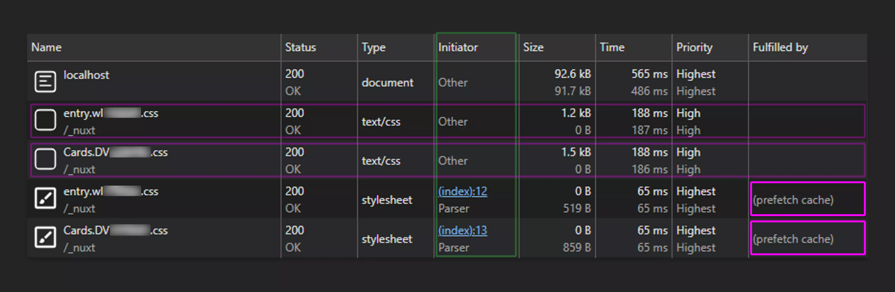
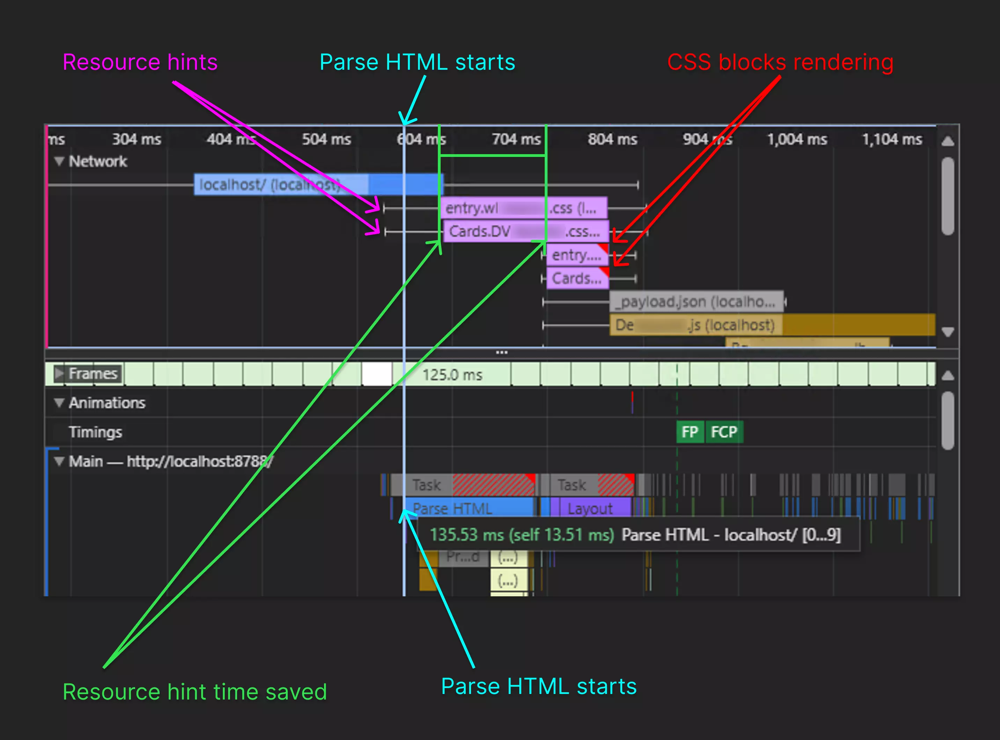

<!--
Get your module up and running quickly.

Find and replace all on all files (CMD+SHIFT+F):
- Name: Nuxt Resources Hints
- Package name: nuxt-resource-hints
- Description: Adds HTTP header resource hints for resources in your Nuxt App.
-->

# Nuxt Resources Hints

[![npm version][npm-version-src]][npm-version-href]
[![npm downloads][npm-downloads-src]][npm-downloads-href]
[![License][license-src]][license-href]
[![CodeRabbit][coderabbit-pr-reviews]][coderabbit-pr-reviews-href]
[![Nuxt][nuxt-src]][nuxt-href]

Nuxt module that adds HTTP header resource hints for resources in your Nuxt App. 

Resource hints allow the browser to discover and request resources earlier in the page loading process for faster page loading.

See the [example](#example) below.

You can learn more about resources hints at:
[https://web.dev/learn/performance/resource-hints](https://web.dev/learn/performance/resource-hints)

- [✨ &nbsp;Release Notes](/CHANGELOG.md)
- [🏀 Online playground](https://stackblitz.com/github/IO-Fire/nuxt-resource-hints?file=playground%2Fapp.vue)
<!-- - [📖 &nbsp;Documentation](https://example.com) -->

## Features

<!-- Highlight some of the features your module provide here -->
- 🚀&nbsp;Faster Page Loading
- ✅&nbsp;Nuxt 4 Support
- ✅&nbsp;SSR+SSG Support
- 🖼️&nbsp;Nuxt Image Support

## Quick Setup

Install the module to your Nuxt application with one command:

```bash
npx nuxi module add nuxt-resource-hints
```

That's it! You can now use Nuxt Resources Hints in your Nuxt app

## Example:

Nuxt Resources Hints adds hints to the web browser of upcoming resources.
To hint at the render blocking CSS the link header is added to the response.

Identifying the resources required early in HTTP headers allows the browser can request these resources simultaneously while waiting for the HTML parser to identify these resources. 

The longer the parser takes to parse the page document, the more time is need for fetching resources for the document. 

### Response Lines Overview

The Link header on line `4` for the resources on line `26` and `27` are added to the [`Link`](https://developer.mozilla.org/en-US/docs/Web/HTTP/Headers/Link) header.

##### Line 4

Extract of the HTTP response from the server:

```http
Link: </_nuxt/entry.CULgFwK1.css>; rel="prefetch"; as="style"; crossorigin; fetchpriority="high", </_nuxt/ContentToc.Di3Xiqq1.css>; rel="prefetch"; as="style"; crossorigin; fetchpriority="high"
```

The [`Link`](https://developer.mozilla.org/en-US/docs/Web/HTTP/Headers/Link) header is telling the browser to prefetch the specified CSS files with high priority, enabling faster page load times when those styles are needed.

CSS files identified:
- `/_nuxt/entry.CULgFwK1.css`
- `/_nuxt/ContentToc.Di3Xiqq1.css`

##### Lines 26 - 27

Extract of the HTTP response's contents from the server as HTML:

```html
    <link rel="stylesheet" href="/_nuxt/entry.CULgFwK1.css" crossorigin>
    <link rel="stylesheet" href="/_nuxt/ContentToc.Di3Xiqq1.css" crossorigin>
```

The HTML link code for the styles identified on line `4`.

CSS files identified:
- `/_nuxt/entry.CULgFwK1.css`
- `/_nuxt/ContentToc.Di3Xiqq1.css`

### HTTP Server Response
```diff
HTTP/2.0 200 OK
Content-Type: text/html; charset=UTF-8
Content-Length: 1234
Link: </_nuxt/entry.CULgFwK1.css>; rel="prefetch"; as="style"; crossorigin; fetchpriority="high", </_nuxt/ContentToc.Di3Xiqq1.css>; rel="prefetch"; as="style"; crossorigin; fetchpriority="high"

```
```html
<!DOCTYPE html>
<html lang="en" data-capo="">

<head>
    <meta charset="utf-8">
    <meta name="viewport" content="width=device-width, initial-scale=1">
    <title>My Page</title>
    <meta ...>
    <meta ...>
    <meta ...>
    <meta ...>
    <meta ...>
    <meta ...>
    <meta ...>
    <meta ...>
    <meta ...>
    <style>...</style>
    <style>...</style>
    <style>...</style>
    <style>...</style>
    <link rel="stylesheet" href="/_nuxt/entry.CULgFwK1.css" crossorigin>
    <link rel="stylesheet" href="/_nuxt/ContentToc.Di3Xiqq1.css" crossorigin>
    <link rel="preload" as="fetch" crossorigin="anonymous"
        href="/docs/community/contribution/_payload.json?6afb007e-bd17-4be8-9ad0-cf237cb47582">
    <link rel="modulepreload" as="script" crossorigin href="/_nuxt/CRzzB7A9.js">
    <link rel="modulepreload" as="script" crossorigin href="/_nuxt/BIeF1yTG.js">
...
```

In this example the styles have been shortened for readability, the browser will have to read past all these styles and other head contents before identifying the styles. As the styles resources are retrieved prior with the `Link` header's `prefetch` parameters, page rendering has the resources sooner. 

## Performance Analysis

The current Performance Analysis is out dated.
The expected savings for [Largest Contentful Paint (LCP)](https://web.dev/articles/lcp) is could be between `10ms` and `30ms`. The new system is no longer shown in `Fulfilled By`.

<details><summary>Outdated Performance Analysis</summary>
<p>

> Test sample size of 1

The below image shows the Network fetching the styles ahead of the parser identifying the required resources. 

The parser's requests for the styles are marked as `Fulfilled by` with `(prefetch cache)`.

> CPU: `No throttling`,  Network: `4G Fast`, Settings: `Big request rows`, Columns: `Priority`, `Fulfilled By`



The below image shows the Performance diagram, where the network requests start and end and what time the HTML parser starts and ends. The browser requests the styles before the parser starts, the parser later identifies the styles with note they are render blocking while the browser is already downloading the styles from the resource hints.


</p>
</details>

## Nuxt Image

Preload responsive images with Nuxt Image ([@nuxt/image](https://image.nuxt.com/)).

Using the `<NuxtImg>` component and the [`preload`](https://image.nuxt.com/usage/nuxt-img#preload) prop.

Nuxt Image's `<link>` tags are copied by `nuxt-resource-hints` to the Link header.

Learn more about preloading images at [https://web.dev/articles/preload-responsive-images](https://web.dev/articles/preload-responsive-images). Use cases include images above (fetch priority high) and just below (fetch priority low) the fold / carousel.

### Nuxt Image Example

> [!IMPORTANT]
> Links are only created when using [`preload`](https://image.nuxt.com/usage/nuxt-img#preload) on <NuxtImg>.

```vue
<NuxtImg src="..." preload />
<NuxtImg src="..." :preload="{ fetchPriority: 'low' }" />
<NuxtImg src="..." :preload="{ fetchPriority: 'high' }" />
```

```html
<link rel="preload" as="image" href="..." imagesrcset="...">
<link rel="preload" as="image" href="..." imagesrcset="..." fetchpriority="low">
<link rel="preload" as="image" href="..." imagesrcset="..." fetchpriority="high">
```

> [!NOTE]
> Recommend: Nuxt Image 2.0.0 or higher for `imagesrcset` support.

## Contribution

<details>
  <summary>Local development</summary>
  
  ```bash
  # Install dependencies
  npm install
  
  # Generate type stubs
  npm run dev:prepare
  
  # Develop with the playground
  npm run dev
  
  # Build the playground
  npm run dev:build
  
  # Run ESLint
  npm run lint
  
  # Run Vitest
  npm run test
  npm run test:watch
  
  # Release new version
  npm run release
  ```

</details>


## TODO:
- [ ] Test Safari
- [ ] Test Firefox
- [ ] Test Regular SSR
- [ ] Test hook execution order

<!-- Badges -->
[npm-version-src]: https://img.shields.io/npm/v/nuxt-resource-hints/latest.svg?style=flat&colorA=020420&colorB=00DC82
[npm-version-href]: https://npmjs.com/package/nuxt-resource-hints

[npm-downloads-src]: https://img.shields.io/npm/dm/nuxt-resource-hints.svg?style=flat&colorA=020420&colorB=00DC82
[npm-downloads-href]: https://npm.chart.dev/nuxt-resource-hints

[license-src]: https://img.shields.io/npm/l/nuxt-resource-hints.svg?style=flat&colorA=020420&colorB=00DC82
[license-href]: https://npmjs.com/package/nuxt-resource-hints

[nuxt-src]: https://img.shields.io/badge/Nuxt-020420?logo=nuxt
[nuxt-href]: https://nuxt.com

[coderabbit-pr-reviews]: https://img.shields.io/coderabbit/prs/github/IO-Fire/nuxt-resource-hints?utm_source=oss&utm_medium=github&utm_campaign=IO-Fire%2Fnuxt-resource-hints&labelColor=020420&color=00DC82&link=https%3A%2F%2Fcoderabbit.ai&label=CodeRabbit+Reviews
[coderabbit-pr-reviews-href]: https://www.coderabbit.ai/
